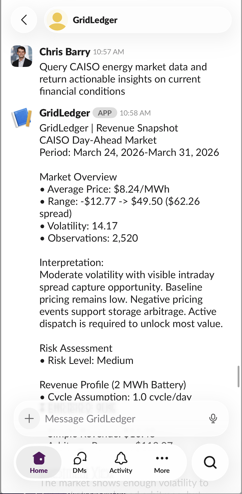

## GridLedger

**AI-native revenue intelligence for energy assets.**
GridLedger turns live electricity price data into underwriting-style revenue snapshots for battery projects — and surfaces them through a web dashboard.

- **Repo**: `https://github.com/cbarry10/GridLedger`
- **Status**: Prototype v0.1 – single-node, single-asset revenue snapshot

---

## What GridLedger Does

GridLedger is a deterministic pipeline that:

1. **Ingests market data** — fetches CAISO day-ahead LMP prices for NP15, SP15, and ZP26 trading hubs.
2. **Cleans & normalizes** the dataset into a reproducible schema.
3. **Computes descriptive price metrics** — mean, range, volatility, observations.
4. **Classifies risk** based on price volatility (Low / Medium / High).
5. **Estimates battery revenue** using configurable scenarios (conservative / base / aggressive).
6. **Generates an AI underwriting memo** grounded in those metrics, via Claude.
7. **Writes structured outputs** — JSON, CSV, and text — to a timestamped archive.
8. **Sends a revenue snapshot to Slack** via a message-triggered agent.
9. **Displays results in a web dashboard** — with charts, metric cards, and CSV download.

The goal: go from **raw prices → revenue & risk snapshot → investor-ready memo** in one command.

### 📸 Example Output



---

## Architecture

The pipeline is intentionally simple and modular:

```
GridLedger/
├── main.py                        # Orchestrates the full AC1–AC6 pipeline
├── requirements.txt
│
├── gridledger/
│   ├── tasks/
│   │   ├── ingestion.py           # AC1: Fetch & normalize CAISO LMP data
│   │   ├── metrics.py             # AC2: Compute descriptive price metrics
│   │   ├── revenue.py             # AC3: Estimate battery revenue
│   │   ├── risk.py                # AC4: Classify volatility risk
│   │   ├── memo.py                # AC5: Generate AI underwriting memo (Claude)
│   │   └── output.py              # AC6: Save JSON / CSV / text outputs
│   ├── config/
│   │   └── settings.py            # Dates, scenarios, API keys, thresholds
│   └── run.py                     # Subprocess wrapper for agent orchestrators
│
├── agent/
│   ├── slack_listener.py          # Slack bot — triggers pipeline on any message
│   └── claw_runner.py             # Pipeline subprocess wrapper for Slack agent
│
├── dashboard/
│   ├── app.py                     # Flask web server (5 API routes)
│   └── templates/
│       └── index.html             # Single-page dashboard UI (Chart.js)
│
├── data/
│   └── hourly_lmp.csv             # Normalized hourly LMP cache (pipeline output)
│
└── outputs/
    └── YYYY-MM-DD/
        ├── summary.json           # Full metrics + revenue + memo
        ├── metrics.csv            # Single-row metrics table
        └── report.txt             # Human-readable text report
```

All pipeline steps are **deterministic**: the same inputs produce the same metrics, revenue, risk label, and memo.

---

## Dashboard

The web dashboard reads from the existing `outputs/` and `data/` directories — no extra configuration needed after the pipeline has run at least once.

**Features:**
- **Metric cards** — avg price, price range (min→max), volatility, risk level badge, observation count
- **Slack output panel** — displays the exact message sent to Slack, with run timestamp
- **Revenue snapshot** — simple and arbitrage revenue estimates with battery assumptions
- **LMP price chart** — interactive 7-day hourly line chart for all three CAISO nodes (NP15, SP15, ZP26)
- **CSV download** — one-click download of the latest `metrics.csv`

**Run the dashboard:**

```bash
python dashboard/app.py
```

Then open `http://localhost:5050` in your browser.

---

## Quickstart

### 1. Clone and set up Python

```bash
git clone https://github.com/cbarry10/GridLedger.git
cd GridLedger

python -m venv venv
source venv/bin/activate   # Windows: venv\Scripts\activate
pip install -r requirements.txt
```

### 2. Configure environment variables

Create a `.env` file in the project root:

```
ANTHROPIC_API_KEY=sk-ant-...
SLACK_BOT_TOKEN=xoxb-...       # optional — only needed for Slack agent
SLACK_APP_TOKEN=xapp-...       # optional — only needed for Slack agent
```

### 3. Run the pipeline

```bash
python main.py
```

This fetches the last 7 days of CAISO prices, computes metrics, estimates revenue, generates a memo, and archives all outputs to `outputs/YYYY-MM-DD/`.

### 4. Launch the dashboard

```bash
python dashboard/app.py
```

Open `http://localhost:5050` to view the revenue snapshot, price chart, and download the CSV.

### 5. (Optional) Run the Slack agent

```bash
cd agent
python slack_listener.py
```

Send any message to the bot — it will run the pipeline and reply with the revenue snapshot.

---

## Configuration

All defaults live in `gridledger/config/settings.py`:

| Setting | Default | Description |
|---|---|---|
| `DEFAULT_NODES` | NP15, SP15, ZP26 | CAISO trading hubs |
| `DEFAULT_START_DATE` | today − 7 days | Analysis window start |
| `DEFAULT_END_DATE` | today | Analysis window end |
| `DEFAULT_BATTERY_MWH` | 2 | Battery capacity |
| `DEFAULT_EFFICIENCY` | 0.90 | Round-trip efficiency |
| `DEFAULT_CYCLES_PER_DAY` | 1.0 | Daily cycle assumption |
| `LOW_VOL_THRESHOLD` | 10 | Volatility → Low risk |
| `HIGH_VOL_THRESHOLD` | 20 | Volatility → High risk |
| `CLAUDE_MODEL` | claude-opus-4-6 | Model for memo generation |

**Battery scenarios** (used in `estimate_revenue()`):

| Scenario | Efficiency | Cycles/Day |
|---|---|---|
| conservative | 88% | 0.6 |
| base | 90% | 1.0 |
| aggressive | 92% | 1.5 |

---

## Outputs

Each pipeline run saves to `outputs/YYYY-MM-DD/`:

| File | Format | Contents |
|---|---|---|
| `summary.json` | JSON | Full metrics, revenue, and memo |
| `metrics.csv` | CSV | Single-row metrics snapshot |
| `report.txt` | Text | Human-readable formatted report |

`data/hourly_lmp.csv` is updated each run with the latest normalized price data and is used by the dashboard chart.
